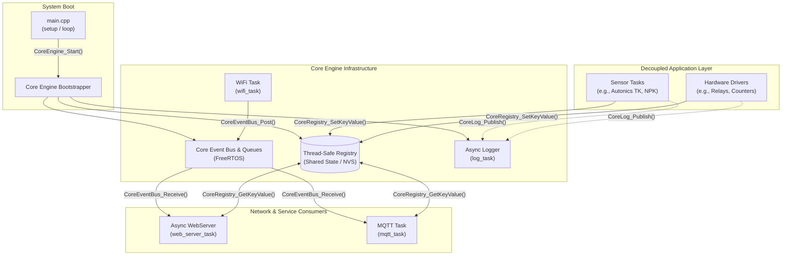

# Mini ESP Framework

A modular, event-driven FreeRTOS firmware framework for ESP32 microcontrollers. The framework decouples hardware peripheral management, sensor data collection, and networking services through a centralized Event Bus and thread-safe registry.

---

## Directory Structure

```text
├── include/                 # Global configuration and shared headers
├── lib/                     # Custom libraries and external modules
├── src/
│   ├── core/                # Core engine, Event Bus, and system tasks
│   ├── driver/              # Hardware peripheral drivers
│   ├── sensor/              # Decoupled sensor acquisition tasks
│   └── main.cpp             # Application entry point (setup & loop)
└── platformio.ini           # PlatformIO project configuration
```

### Component Overview

- **`src/`**: Primary application and system source code.
  - **`main.cpp`**: Minimal entry point that invokes `CoreEngine_Start()` during `setup()` and yields the Arduino `loop()` to FreeRTOS scheduling.
  - **`src/core/`**: Core system infrastructure including engine lifecycle management, FreeRTOS event routing, thread-safe config registry, asynchronous logging, WiFi connection management, WebServer, and MQTT tasks.
  - **`src/driver/`**: Low-level drivers for hardware peripheralsl. 
  - **`src/sensor/`**: Independent sensor tasks executing asynchronously on FreeRTOS.
- **`lib/`**: Custom libraries and external modules.
  - **[TI Language Interpreter](https://github.com/tien-ce/Write-your-own-interpreter-language)**: Embedded lightweight scripting and interpreter language engine.
  - **[MODBUS Library](https://github.com/tien-ce/Modbus_arduinoIDE)**: Industrial Modbus RTU/ASCII communication protocol library for sensor and PLC interfacing.
- **`include/`**: Global configuration definitions (`config.h`), shared data structures, command registries, and module header files.

---

## Architecture Overview

The framework isolates application tasks (sensors, actuators) from network consumers (WebServer, MQTT) using an asynchronous Event Bus and a thread-safe Key-Value Registry.



### Key Interaction Mechanisms

| API / Mechanism | Mechanism Type | Description |
| :--- | :--- | :--- |
| **`CoreEngine_Start()`** | Bootstrapping | Initializes LittleFS, NVS storage, event queues, and starts core FreeRTOS tasks. |
| **`CoreEventBus_Post()`** | FreeRTOS Queue Push | Publishes system lifecycle events (e.g., `EVENT_WIFI_CONNECTED`). |
| **`CoreEventBus_Receive()`** | FreeRTOS Blocking Pop | Unblocks consumer tasks (WebServer, MQTT) when prerequisite events trigger. |
| **`CoreRegistry_SetKeyValue()`** | Mutex-Protected Write | Allows sensor/driver tasks to publish state metrics safely without direct network dependencies. |
| **`CoreRegistry_GetKeyValue()`** | Mutex-Protected Read | Allows WebServer and MQTT engines to read metrics on-demand. |
| **`CoreLog_Publish()`** | Inter-Task Queue | Dispatches asynchronous, thread-safe logs across WebSocket and Serial interfaces. |

### Architectural Principles

1. **Decoupled Application Layer**: Sensor and hardware tasks run independently in their own FreeRTOS loops. They do not block on network connectivity and interact with the system strictly through thread-safe registry setters and logging APIs.
2. **Event-Driven Lifecycle**: Network-dependent tasks remain suspended or idle until connection events (such as `EVENT_WIFI_CONNECTED`) are broadcast over the Core Event Bus.
3. **Thread-Safe Shared State**: Cross-task data exchanges rely on mutex-synchronized registry access rather than global mutable variables, preventing race conditions.
